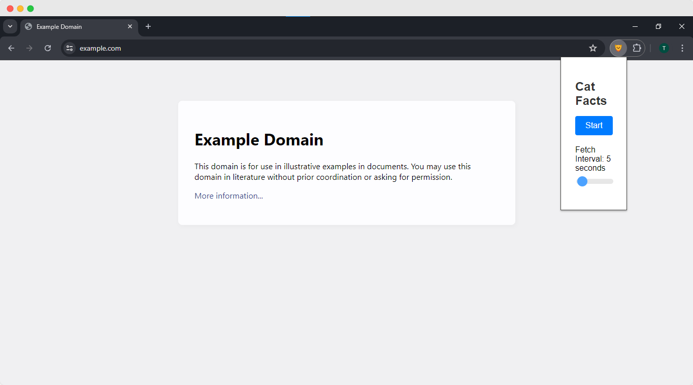
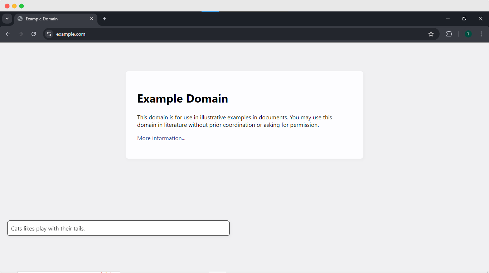

Cat Facts Chrome Extension
===================

Table of Contents
-----------------

-   [Overview](#overview)
-   [Features](#features)
-   [Installation](#installation)
-   [Usage](#usage)
-   [Screenshots](#screenshots)
-   [Technologies Used](#technologies-used)
-   [Contributing](#contributing)

Overview
--------

Cat Facts Extension is a fun Chrome extension that fetches random cat facts from the Cat Facts API and displays them in a popup on the active browser tab. You can start and stop the cat facts feed and adjust the interval at which new facts are fetched.

Features
--------

-   Fetches random cat facts from the Cat Facts API.
-   Displays cat facts in a popup on the active browser tab.
-   Start and stop the cat facts feed.
-   Adjust the interval for fetching new cat facts.
-   Simple and intuitive user interface.

Installation
------------

1.  Clone the repository:

    ```sh

    `git clone https://github.com/your-username/cat-facts-extension.git`

2.  Navigate to the project directory:

    ```sh

    `cd cat-facts-extension`

3.  Install the dependencies:

    ```sh

    `npm install`

4.  Build the project:

    ```sh

    `npm run build`

5.  Load the extension in Chrome:

    -   Open Chrome and navigate to `chrome://extensions/`
    -   Enable "Developer mode" (toggle switch in the top right)
    -   Click on "Load unpacked" and select the `dist/browser` folder from the project directory

Usage
-----

1.  Click on the Cat Facts Extension icon in the Chrome toolbar to open the extension popup.
2.  Click the "Start" button to begin fetching cat facts.
3.  Adjust the fetch interval using the slider.
4.  The button will change to "Stop". Click it to stop fetching cat facts.
5.  Cat facts will be displayed in a popup on the active tab every few seconds (based on the interval you set).

Screenshots
-----------

### Initial Popup


### Cat Fact Popup


Technologies Used
-----------------

-   **Angular**: For creating the user interface.
-   **TypeScript**: For writing type-safe JavaScript.
-   **Chrome Extensions API**: For interacting with the browser.
-   **Cat Facts API**: For fetching random cat facts.

Contributing
------------

Contributions are welcome! Please follow these steps:

1. Fork the repository
2. Create your feature branch (`git checkout -b feature/AmazingFeature`)
3. Commit your changes (`git commit -m 'Add some AmazingFeature'`)
4. Push to the branch (`git push origin feature/AmazingFeature`)
5. Open a pull request

